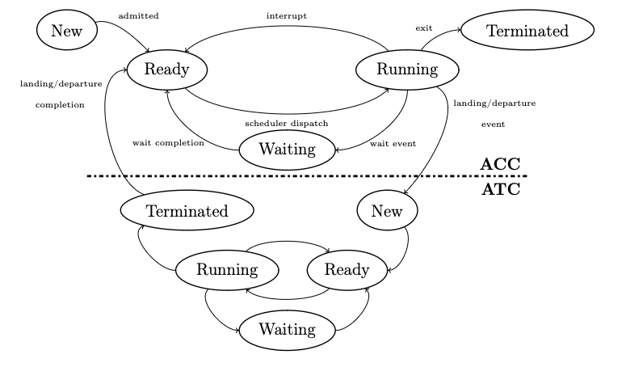

# CMPE250 - Algorithms and Data Structures - Fall 2022 - Project 3

<table>
  <tr>
    <th colspan="3">
        People
    </th>
  </tr>
  <tr>
    <td>Instuctor</td>
    <td>Özlem Durmaz İncel</td>
  </tr>
  <tr>
    <td>Teaching Assistants</td>
    <td>Suzan Ece Ada   Barış Yamansavaçılar</td>
  </tr>
  <tr>
    <td>Student Assistants</td>
    <td>Bahadır Gezer   Batuhan Çelik   Zeynep Buse Aydın   Ömer Faruk Ünal </td>
  </tr>
</table>

## Encore Airlines

    src/
    ├── main
    │   └── java
    │       ├── Project3.java
    │       ├── entities
    │       │   ├── Airport.java
    │       │   └── Flight.java
    │       ├── enums
    │       │   ├── ProcessorStatus.java
    │       │   └── State.java
    │       └── processors
    │           ├── ACC.java
    │           └── ATC.java
    └── resources
    ├── codes.py
    ├── data
    │   ├── airport_codes.json
    │   └── atc_codes.json
    ├── input.py
    └── inputs

[//]: # (#### Check the [description]&#40;./desc/p1_description.pdf&#41; to try out this project. )

### Implementation Notes

Pre-computation phase: Find the connected airport components and add an ATC to each component.

    Discrete Event Simulation phase: Simulate the arrival and departure of flights. Compute this phase
    until all flights have landed. ATC will have to do the procedures, and it should implement some type of
    job scheduling, "round-robin" might be the best option.

    Some flights might be emergencies. These will produce an "interrupt" and start computing right away.

    Hashing: 

    Post-computation phase: Compute the average wait time for each flight.

    Output: Print the average wait time for each flight.

### Flight States

### ACC - Area Control Center

    ACC scheduling -> Round Robin
    ACC states:
            -new
            -ready
            -running
            -waiting
            -terminated

    created:            new     -> ready
    dispatch:           ready   -> running
    interrupt:          running -> ready
    wait:               running -> waiting
    exit:               running -> terminated
    wait completion:    waiting -> ready

    created -> new Flight input: adds the Flight into correct ACC ready queue
        ready: waiting for dispatch, in the correct ACC ready queue

    dispatch -> start processing flight and block ACC
        running: check for clearances, flight plan, flight information, etc.

    interrupt -> scheduling interrupt and unblock ACC

    wait -> pass operation to *departing* ATC and wait for output, and unblock ACC

    wait -> pass operation to *landing* ATC and wait for output, and unblock ACC

    wait -> ask plane for flight details, wait for output, and unblock ACC

    exit -> remove flight from the cycle. Unblock ACC.
        terminated: flight operations are complete.

    wait completion -> reenter ready queue.

### ATC - Air Traffic Control

    ATC scheduling -> multilevel feedback queue
    ATC states:
            -new
            -ready
            -running
            -waiting
            -terminated

    created:           new     -> ready
    dispatch:          ready   -> running
    interrupt:         running -> ready
    wait:              running -> waiting
    exit:              running -> terminated
    wait completion:   waiting -> ready

    created -> new Flight input: adds the Flight into correct ACC ready queue
        ready: waiting for dispatch, in the correct ACC ready queue

    dispatch -> start processing flight and block ATC
        running:
            for landings [get control / landing information, (landing wait), taxi/gate information, (taxi wait),
            disembark/baggage information processing, (disembark/baggage), all successful/wrap up and end communication],

            for departures [get control / boarding/ baggage, (boarding / baggage wait), takeoff information / flight
            plan, (affirmative wait), taxi information, (pushback / taxi wait), ready / waiting to be cleared for
            takeoff, (takeoff), all successful/wrap up and end communication/ pass back to AAC]

    interrupt -> scheduling interrupt and unblock ATC
    interrupt -> mayday, emergency, etc.

    wait -> specified above, and unblock ATC]

    exit -> remove flight from the cycle. Unblock ATC.
        terminated: flight operations are complete.

    wait completion -> reenter ready queue.

### Processing Times

#### index -> time  
 *  0 -> ACC initial processing time (r)  
 *  1 -> Passing flight information to ACC time (w)  
 *  2 -> ACC transfer control to ATC processing time (r) (ACC -> departure ATC) (ACC wait until ATC termination)  
 *  3 -> initial ATC processing time (r)  
 *  4 -> boarding wait time (w)  
 *  5 -> taxi information processing time (r)  
 *  6 -> taxi wait time (w)  
 *  7 -> takeoff clearance processing time (r)  
 *  8 -> takeoff && getting away from the ATC control area wait time (w)  
 *  9 -> transfer control to ACC processing time (r) (departure ATC -> ACC) (departure ATC terminate)  
 * 10 -> ACC take control back and flight path processing time (r)  
 * 11 -> flight wait time (w)  
 * 12 -> ACC transfer control to ATC processing time (r) (ACC -> ATC) (ACC wait until ATC termination)  
 * 13 -> ATC initial processing time && runway information (r)  
 * 14 -> flight landing wait time (w)  
 * 15 -> taxi information processing time (r)  
 * 16 -> taxi wait time (w)  
 * 17 -> gate information processing time (r)  
 * 18 -> disembark wait time (w)  
 * 19 -> terminal processing time (r) (landing ATC -> ACC) (landing ATC terminate)  
 * 20 -> ACC take control back && file flight record processing time (r) (ACC terminate)  

### Input file format:

1. First line: \<number of airports> \<number of flights> \<number of ACCs>
2. Next \<number of airports> lines: \<airport code> \<ACC code> \<list of connections>
3. Next \<number of flights> lines: \<flight code> \<admission time> \<departure airport code> \<arrival airport code> \<list of operation times>

#### Additional

    ACC codes are 4 capital letters, airport codes are 3 capital letters. Both are unique.
    ATC codes start with 4 capital letters (which are the ACC code for that ATC), followed by a two digit number.
    The two digit number is generated by the ACC using hashing. The ATC code is unique.

    ATC and airports are mapped one-to-one. Each airport has one ATC, and each ATC is responsible for one airport.
    ACC's are one-to-many mapped to ATC's. Each ACC is responsible for one or more ATC's. 
    